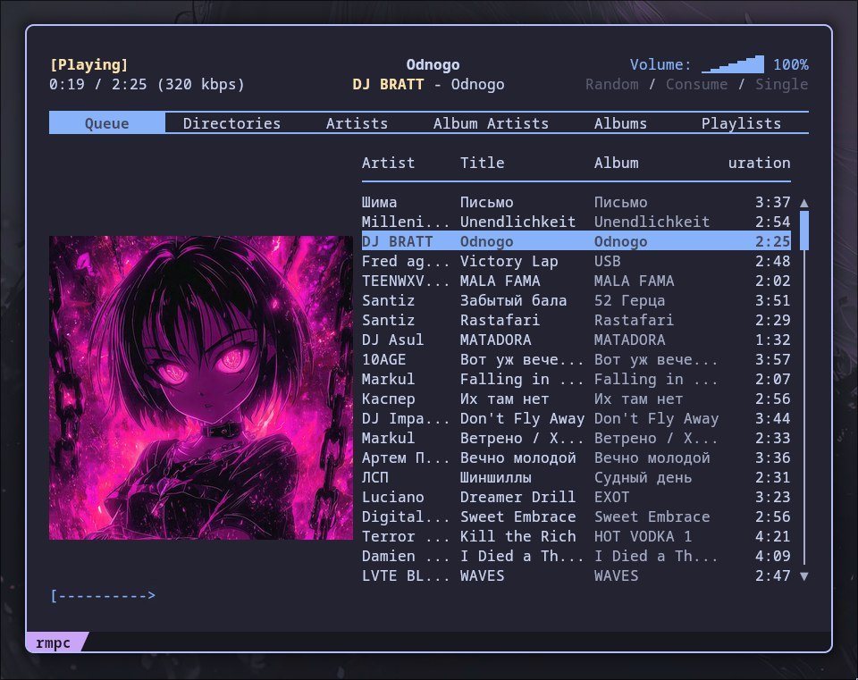

# Yandex Music RMPC Bridge

A lightweight synchronization bridge between **Yandex Music** and your local **Music Player Daemon (MPD)**. Specifically designed for users who prefer terminal-based workflows using the **rmpc** client and **Hyprland**.



## Key Features

- **API Integration**: Authenticates with Yandex Music to fetch your "Liked" tracks.
- **Smart Sync**: Downloads high-quality MP3s (320kbps) only if they aren't already in your local library.
- **Metadata Tagging**: Automatically writes ID3v2.3 tags (Artist, Title, Album) and embeds high-resolution cover art for full compatibility with MPD/rmpc.
- **MPD Control**: Updates the MPD database, clears the current queue, and populates it with your synced library.
- **TUI Frontend**: Launches the `rmpc` interface in a specialized terminal window (`kitty` by default).

## Prerequisites

### System Dependencies
- **MPD**: The music player backend.
- **rmpc**: Terminal-based Rust Music Player Client.
- **kitty**: Terminal emulator (used in the launch script).
- **mpc**: CLI control for MPD.
- **mpd-mpris**: (Optional) For system-wide media key support and `playerctl` integration.

### Python Requirements
- `requests`
- `python-mpd2`
- `mutagen` (for ID3 tagging)

## Installation

### 1. Clone the Repository
```bash
mkdir -p ~/.config/yamusic
git clone [https://github.com/diominvd/yandex-music-rmpc.git](https://github.com/diominvd/yandex-music-rmpc.git) ~/.config/yamusic
cd ~/.config/yamusic
```

### 2. Set Up Virtual Environment
```bash
python -m venv venv
source venv/bin/activate
pip install -r requirements.txt
```

### 3. Edit Variables
Edit next variables in `yamusic_start.sh` for your convenience:
```bash
CONFIG_DIR="$HOME/.config/yamusic"
PY_PATH="$CONFIG_DIR/venv/bin/python"
SCRIPT_PATH="$CONFIG_DIR/yamusic_mpd.py"
PLAYER_CLASS="music_player"
```

### 4. Get Yandex Music Token
You need an OAuth token to access your library. For get token use this repository: [https://github.com/Sorrow446/Yandex-Music-Downloader](https://github.com/Sorrow446/Yandex-Music-Downloader)

### 5. Configure Environment
Add the following to your shell configuration (e.g., ~/.zshrc or ~/.bashrc):
```bash
export YAMUSIC_TOKEN="your_oauth_token_here"
export YAMUSIC_DIR="~/Music/yandex-music"
```

### 6. Link to MPD
Ensure your mpd.conf points to a directory that includes your YAMUSIC_DIR. For example, if your MPD music directory is ~/Music, the script will sync tracks to ~/Music/yandex-music.

## Usage

### Manual Launch
To sync and start the player:
```bash
chmod +x yamusic_start.sh
./yamusic_start.sh
```

### Stop Playing
To stop playing and clear the queue:
```bash
chmod +x yamusic_stop.sh
./yamusic_stop.sh
```

### Hyprland Integration
Add this line to your hyprland.conf to toggle the player with a keybind:
```bash
# Toggle Yandex Music with Super + Y
bind = $mainMod, Y, exec, /path/to/script/yamusic_start.sh
```

## Project Structure
- `yamusic_mpd.py`: Core Python logic for API interaction and file tagging.
- `yamusic_start.sh`: Main management script (handles MPD state, MPRIS bridge, and UI).
- `requirements.txt`: Python library dependencies.

## License
MIT
